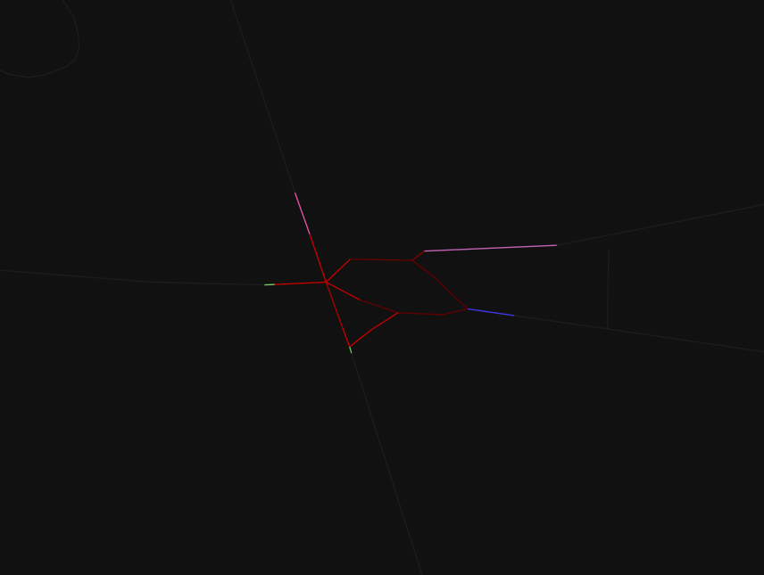

# crossroads segmentation

**Crossroads segmentation** is a python tool that produces automatic segmentations of data from OpenStreetMap.

## Dependancies

* [OSMnx](https://osmnx.readthedocs.io/) that includes [NetworkX](https://networkx.org/) and [pandas](https://osmnx.readthedocs.io/)
* [argparse](https://docs.python.org/3/library/argparse.html)

## Usage

The main script to use is ```get-crossroad-description.py```. You will find a complete description of the possible parameters using the following command:

* ```get-crossroad-description.py --help```

This tool is using OSMnx to download OpenStreetMap data from the selected region. It uses a cache, stored in ```cache/``` directory. If a region has already been asked, it will use the cached data and not download it again. You can of course delete the cache directory to download again the data.

The location of the region can be choosen using coordinates (```--by-coordinates LAT LNG```) or using an predefined coordinate defined by a name (```--by-name NAME```). A radius (```-r VALUE```) with a default value of 150 meters can be adjusted to choose the size of the region to consider.

Several outputs are possible:

* to display the segmentation with all the crossings in the region (```--display-segmentation```), or only focussing on the main crossroad (```--display-main-crossroad```) closest to the input coordinate. This second display gives also the branches of the crossroad.
* to produce a text version of the selection (```--to-text```, ```--to-text-all```) in the standard output
* to produce a ```json``` file that contains all the detected crossroads (```--to-json-all FILENAME```) or only the main one (```--to-json FILENAME```). Branches are also contained in this output.

The last stage of the segmentation algorithm consists in merging small crossroads into large one if specific structures are detected, and considering a connection intensity (```--connection-intensity NB```) with typical values between 2 and 5, corresponding to distance threshold defined by this coefficient multiplied by an estimation of the branches width.


Several of these outputs (```--to-json```, ```--to-json-all```, ```--display-main-crossroad```) can be adjusted using the parameter ```--multiscale``` to describe the small crossroad that has been merged to produce the large ones.


## Examples


```./get-crossroad-description.py --by-name POC1  --display-main-crossroad --connection-intensity 5 --multiscale```




```./get-crossroad-description.py --by-name obélisque  --display-segmentation -r 1000```


